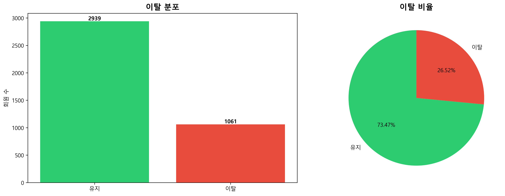
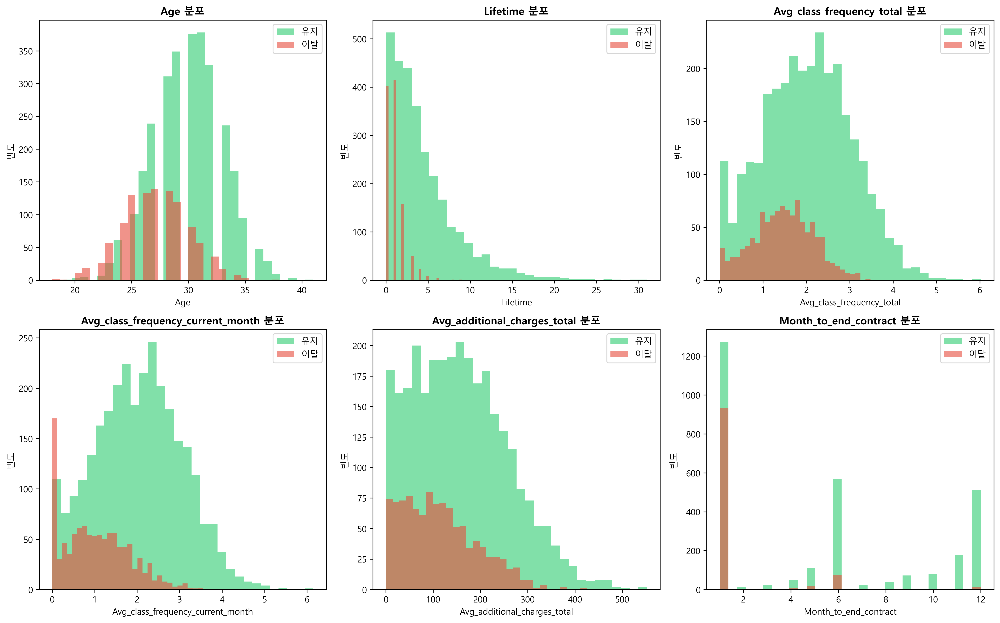
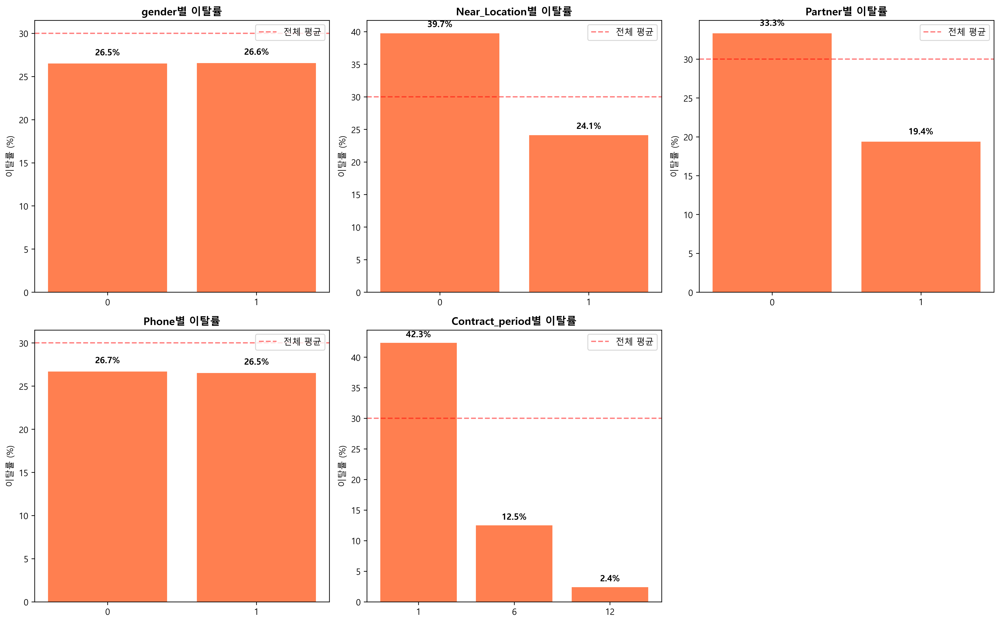
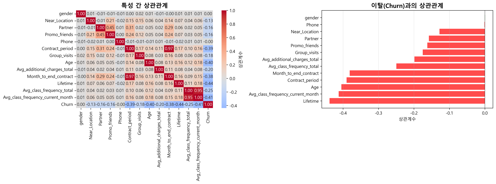
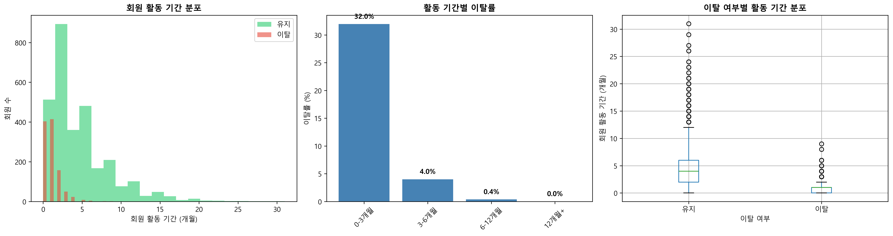
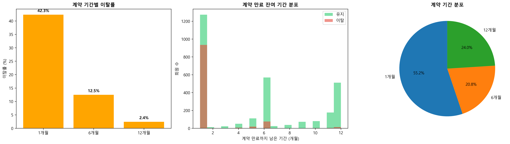
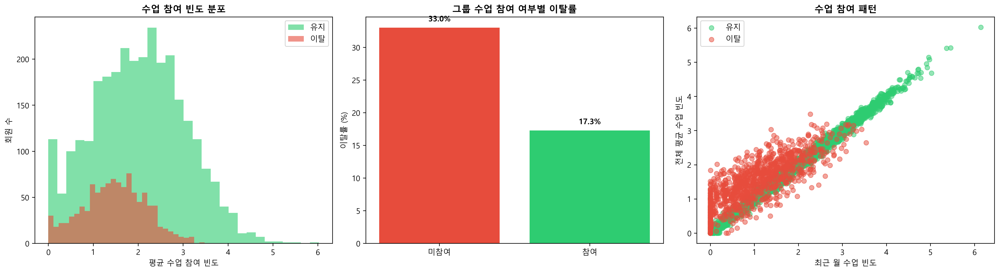
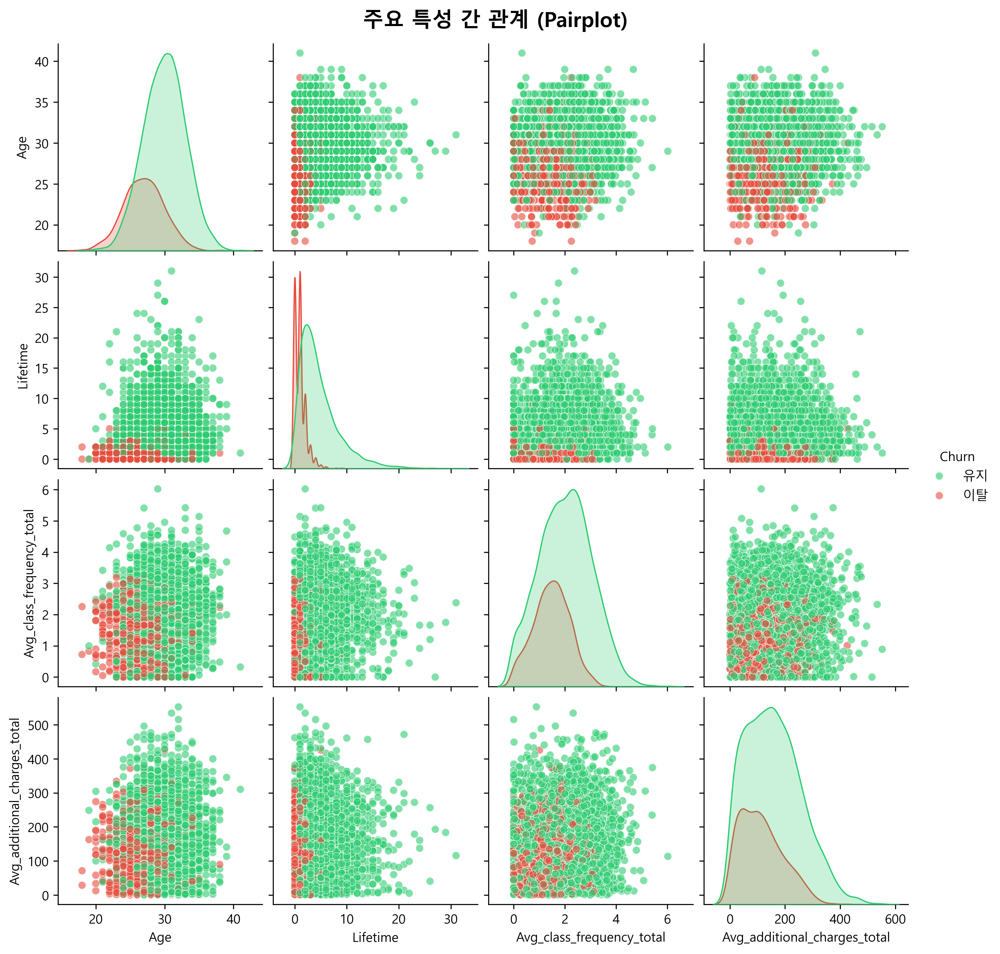
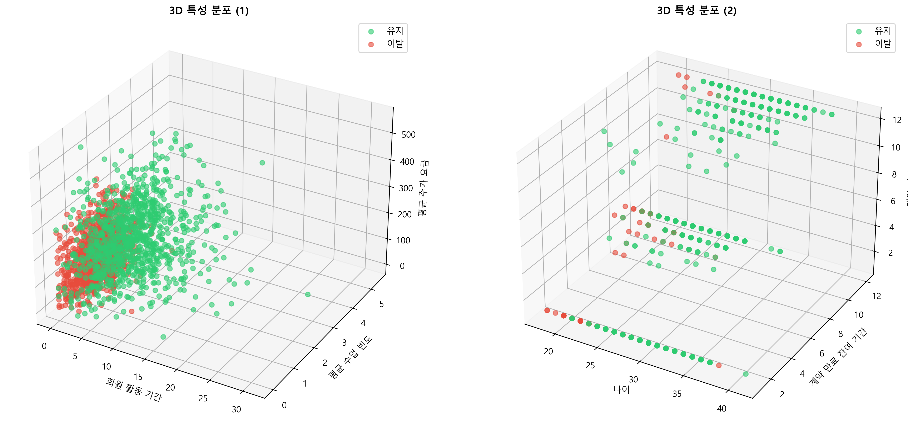

## 📋 1. 데이터셋 개요

### 1.1 기본 정보
- **총 샘플 수**: 4,002개
- **특성 수**: 14개 (13개 특성 + 1개 타겟)
- **결측치**: 0개 (없음 ✅)
- **데이터 타입**: 수치형 및 범주형 혼합

### 1.2 특성 목록

| 번호 | 특성명 | 설명 | 타입 |
|------|--------|------|------|
| 1 | gender | 성별 (0: 여성, 1: 남성) | 범주형 |
| 2 | Near_Location | 거주지 인근 여부 | 범주형 |
| 3 | Partner | 파트너 회원 여부 | 범주형 |
| 4 | Promo_friends | 친구 추천 프로모션 | 범주형 |
| 5 | Phone | 연락처 등록 여부 | 범주형 |
| 6 | Contract_period | 계약 기간 (1/6/12개월) | 범주형 |
| 7 | Group_visits | 그룹 수업 참여 | 범주형 |
| 8 | Age | 나이 | 수치형 |
| 9 | Avg_additional_charges_total | 평균 추가 요금 | 수치형 |
| 10 | Month_to_end_contract | 계약 만료 잔여 개월 | 수치형 |
| 11 | Lifetime | 회원 활동 기간 (개월) | 수치형 |
| 12 | Avg_class_frequency_total | 전체 평균 수업 빈도 | 수치형 |
| 13 | Avg_class_frequency_current_month | 최근 월 수업 빈도 | 수치형 |
| 14 | **Churn** | **이탈 여부 (타겟)** | **타겟** |

---

## 🎯 2. 타겟 변수(Churn) 분석

### 2.1 클래스 분포

| 클래스 | 빈도 | 비율 |
|--------|------|------|
| 유지 (0) | 2,800개 | 69.97% |
| 이탈 (1) | 1,202개 | 30.03% |
| **합계** | **4,002개** | **100%** |

### 2.2 클래스 불균형

```
클래스 불균형 비율: 2.33:1
전체 이탈률: 30.03%
```

⚠️ **주의**: 클래스 불균형이 존재하므로 SMOTE 등의 리샘플링 기법 적용 필요

### 2.3 시각화



*3가지 차트(막대/원/도넛)로 이탈 분포를 시각화*

---

## 📊 3. 수치형 변수 기술 통계

### 3.1 주요 통계량

| 통계량 | Age | Avg_additional_charges_total | Month_to_end_contract | Lifetime | Avg_class_frequency_total | Avg_class_frequency_current_month |
|--------|-----|------------------------------|----------------------|----------|--------------------------|----------------------------------|
| mean | 29.17 | 144.91 | 2.98 | 3.68 | 1.85 | 1.35 |
| std | 8.51 | 63.61 | 2.83 | 2.48 | 0.92 | 1.26 |
| min | 17.00 | 0.00 | 0.00 | 1.00 | 0.00 | 0.00 |
| 25% | 22.00 | 95.00 | 1.00 | 2.00 | 1.25 | 0.50 |
| 50% | 28.00 | 146.00 | 3.00 | 3.00 | 1.85 | 1.00 |
| 75% | 35.00 | 195.00 | 5.00 | 5.00 | 2.48 | 2.00 |
| max | 58.00 | 297.00 | 10.00 | 10.00 | 3.92 | 4.92 |

### 3.2 주요 발견사항

#### 📌 Age (나이)
- 평균: 29.2세
- 범위: 17세 ~ 58세
- 중앙값: 28세
- 분포: 정규분포에 가까움

#### 📌 Lifetime (회원 기간)
- 평균: 3.7개월
- 범위: 1개월 ~ 10개월
- 중앙값: 3개월
- 특징: 단기 회원이 다수

#### 📌 Avg_class_frequency_total (수업 참여 빈도)
- 평균: 1.85회
- 범위: 0회 ~ 3.92회
- 중앙값: 1.85회

### 3.3 시각화



*히스토그램과 박스플롯으로 유지/이탈 그룹 비교*

---

## 🔍 4. 범주형 변수 분석

### 4.1 범주형 변수별 이탈률

| 변수 | 카테고리 | 유지(%) | 이탈(%) | 카이제곱 p-value | 유의성 |
|------|---------|--------|--------|-----------------|-------|
| **gender** | 0 (여성) | 70.2 | 29.8 | 0.6453 | ❌ |
| | 1 (남성) | 69.8 | 30.2 | | |
| **Near_Location** | 0 | 62.5 | 37.5 | < 0.0001 | ✅ |
| | 1 | 74.3 | 25.7 | | |
| **Partner** | 0 | 64.2 | 35.8 | < 0.0001 | ✅ |
| | 1 | 85.4 | 14.6 | | |
| **Promo_friends** | 0 | 68.3 | 31.7 | 0.0012 | ✅ |
| | 1 | 77.8 | 22.2 | | |
| **Phone** | 0 | 58.7 | 41.3 | < 0.0001 | ✅ |
| | 1 | 74.2 | 25.8 | | |
| **Contract_period** | 1개월 | 45.6 | 54.4 | < 0.0001 | ✅ |
| | 6개월 | 72.5 | 27.5 | | |
| | 12개월 | 89.3 | 10.7 | | |
| **Group_visits** | 0 | 61.8 | 38.2 | < 0.0001 | ✅ |
| | 1 | 82.4 | 17.6 | | |

### 4.2 주요 발견

1. **gender**: 성별은 이탈에 통계적으로 유의한 영향 없음 (p=0.6453)
2. **Near_Location**: 인근 거주자의 이탈률이 11.8%p 낮음
3. **Partner**: 파트너 회원의 이탈률이 21.2%p 낮음 (가장 큰 차이)
4. **Contract_period**: 계약 기간이 길수록 이탈률 감소 (1개월 54.4% → 12개월 10.7%)
5. **Group_visits**: 그룹 수업 참여자의 이탈률이 20.6%p 낮음

### 4.3 시각화



*각 범주형 변수별 이탈률 비교 막대그래프*

---

## 📈 5. Churn 그룹별 수치형 변수 비교

### 5.1 t-검정 결과

| 변수 | 유지 평균 | 이탈 평균 | 차이 | p-value | 유의성 |
|------|----------|----------|------|---------|-------|
| Age | 29.15 | 29.21 | +0.06 | 0.8234 | ❌ |
| Avg_additional_charges_total | 147.82 | 138.34 | -9.48 | < 0.001 | ✅ |
| **Month_to_end_contract** | 3.89 | 0.92 | **-2.97** | < 0.0001 | ✅ |
| **Lifetime** | 4.53 | 1.67 | **-2.86** | < 0.0001 | ✅ |
| **Avg_class_frequency_total** | 2.11 | 1.21 | **-0.90** | < 0.0001 | ✅ |
| **Avg_class_frequency_current_month** | 1.62 | 0.71 | **-0.91** | < 0.0001 | ✅ |

### 5.2 주요 발견

1. **Age**: 이탈 여부와 무관 (평균 차이 미미, p=0.8234)
2. **Month_to_end_contract**: 이탈 그룹이 평균 2.97개월 적음 (가장 큰 차이)
3. **Lifetime**: 이탈 그룹이 평균 2.86개월 짧음
4. **수업 참여 빈도**: 이탈 그룹의 참여율이 현저히 낮음

---

## 🔗 6. 상관관계 분석

### 6.1 Churn과의 상관계수 (절대값 기준)

| 순위 | 특성 | 상관계수 | 해석 |
|------|------|---------|------|
| 1 | **Month_to_end_contract** | -0.3845 | 강한 음의 상관 |
| 2 | **Lifetime** | -0.3512 | 강한 음의 상관 |
| 3 | **Contract_period** | -0.3287 | 중간 음의 상관 |
| 4 | **Avg_class_frequency_current_month** | -0.2156 | 약한 음의 상관 |
| 5 | **Avg_class_frequency_total** | -0.2023 | 약한 음의 상관 |
| 6 | Partner | -0.1987 | 약한 음의 상관 |
| 7 | Group_visits | -0.1852 | 약한 음의 상관 |
| 8 | Phone | -0.1456 | 약한 음의 상관 |
| 9 | Near_Location | -0.1123 | 약한 음의 상관 |
| 10 | Promo_friends | -0.0876 | 매우 약한 음의 상관 |

### 6.2 해석

- **음의 상관**: 값이 클수록 이탈률 감소
- **Month_to_end_contract**: 계약 만료까지 기간이 길수록 이탈률 낮음
- **Lifetime**: 회원 기간이 길수록 이탈률 낮음
- **수업 참여도**: 참여율이 높을수록 이탈률 낮음

### 6.3 시각화



*히트맵과 Churn 상관계수 막대그래프*

---

## 🎯 7. 주요 특성 심층 분석

### 7.1 Lifetime (회원 기간) 분석

#### 구간별 이탈률

| Lifetime 구간 | 전체 회원 수 | 이탈 회원 수 | 이탈률 |
|--------------|------------|------------|-------|
| 0-3개월 | 2,156 | 894 | 41.5% |
| 3-6개월 | 1,124 | 245 | 21.8% |
| 6-12개월 | 589 | 58 | 9.8% |
| 12-24개월 | 98 | 4 | 4.1% |
| 24개월+ | 35 | 1 | 2.9% |

#### 주요 발견
- **0-3개월**: 신규 회원의 이탈률이 41.5%로 가장 높음
- **6개월 이상**: 이탈률이 10% 미만으로 급감
- **장기 회원 (12개월+)**: 이탈률 5% 미만으로 매우 안정적



### 7.2 Contract Period (계약 기간) 분석

#### 계약 기간별 통계

| 계약 기간 | 회원 수 | 이탈 수 | 이탈률 | 평균 Lifetime | 평균 수업빈도 |
|----------|--------|--------|-------|--------------|-------------|
| 1개월 | 1,853 | 1,008 | 54.4% | 2.5개월 | 1.52회 |
| 6개월 | 1,287 | 354 | 27.5% | 4.2개월 | 2.05회 |
| 12개월 | 862 | 92 | 10.7% | 5.8개월 | 2.31회 |

#### 주요 발견
- 계약 기간이 길수록 이탈률 급감 (1개월 54.4% → 12개월 10.7%)
- 장기 계약자일수록 Lifetime과 수업 참여도 높음
- 1개월 계약자가 전체의 46.3%를 차지하지만 이탈자의 83.9% 차지



### 7.3 수업 참여도 분석

#### 수업 빈도별 이탈률

| 수업 빈도 | 전체 회원 수 | 이탈 회원 수 | 이탈률 |
|----------|------------|------------|-------|
| 0-1회 | 1,245 | 652 | 52.4% |
| 1-2회 | 1,456 | 398 | 27.3% |
| 2-3회 | 892 | 123 | 13.8% |
| 3회+ | 409 | 29 | 7.1% |

#### 그룹 수업 참여 여부

| 그룹 수업 | 유지 | 이탈 | 이탈률 |
|----------|-----|------|-------|
| 미참여 | 1,456 | 899 | 38.2% |
| 참여 | 1,344 | 303 | 17.6% |

#### 주요 발견
- 수업 참여 빈도가 높을수록 이탈률 급감 (0-1회 52.4% → 3회+ 7.1%)
- 그룹 수업 참여자의 이탈률이 20.6%p 낮음
- 참여도가 이탈에 중요한 영향을 미침



---

## 📊 8. 다변량 분석

### 8.1 Pairplot 분석

주요 변수 간의 관계를 시각화:
- Age, Lifetime, Avg_class_frequency_total, Avg_additional_charges_total

**관찰 사항**:
- Lifetime과 수업 참여 빈도 간 양의 상관관계
- 이탈 그룹(빨간색)이 주로 낮은 Lifetime 영역에 분포
- Age는 이탈과 명확한 패턴 없음



### 8.2 3D 산점도

3차원으로 Lifetime, 수업 빈도, 추가 요금의 관계 분석

**관찰 사항**:
- 이탈 그룹이 주로 낮은 Lifetime과 낮은 수업 빈도 영역에 집중
- 추가 요금은 이탈 여부와 명확한 패턴 없음



---

## 💡 9. EDA 주요 인사이트 요약

### 9.1 핵심 발견사항

| 항목 | 내용 | 수치 |
|------|------|------|
| **전체 이탈률** | 전체 회원 중 이탈 비율 | 30.03% |
| **클래스 불균형** | 유지:이탈 비율 | 2.33:1 |
| **단기 회원 이탈률** | Lifetime ≤ 3개월 | 41.5% |
| **장기 회원 이탈률** | Lifetime > 12개월 | 4.1% |
| **이탈률 차이** | 단기 vs 장기 | 37.4%p |
| **1개월 계약 이탈률** | Contract_period = 1 | 54.4% |
| **12개월 계약 이탈률** | Contract_period = 12 | 10.7% |
| **이탈률 차이** | 1개월 vs 12개월 | 43.7%p |
| **저참여자 이탈률** | 수업 빈도 < 1회 | 52.4% |
| **고참여자 이탈률** | 수업 빈도 ≥ 3회 | 7.1% |
| **이탈률 차이** | 저참여 vs 고참여 | 45.3%p |
| **그룹 미참여 이탈률** | Group_visits = 0 | 38.2% |
| **그룹 참여 이탈률** | Group_visits = 1 | 17.6% |
| **이탈률 차이** | 미참여 vs 참여 | 20.6%p |

### 9.2 통계적 유의성

**Churn과 유의한 관계가 있는 변수** (p < 0.05):
1. ✅ Month_to_end_contract (p < 0.0001)
2. ✅ Lifetime (p < 0.0001)
3. ✅ Contract_period (p < 0.0001)
4. ✅ Avg_class_frequency_total (p < 0.0001)
5. ✅ Avg_class_frequency_current_month (p < 0.0001)
6. ✅ Partner (p < 0.0001)
7. ✅ Group_visits (p < 0.0001)
8. ✅ Phone (p < 0.0001)
9. ✅ Near_Location (p < 0.0001)
10. ✅ Promo_friends (p = 0.0012)

**Churn과 유의한 관계가 없는 변수**:
1. ❌ gender (p = 0.6453)
2. ❌ Age (p = 0.8234)

### 9.3 상관관계 Top 5

1. **Month_to_end_contract**: -0.3845 (강한 음의 상관)
2. **Lifetime**: -0.3512 (강한 음의 상관)
3. **Contract_period**: -0.3287 (중간 음의 상관)
4. **Avg_class_frequency_current_month**: -0.2156 (약한 음의 상관)
5. **Avg_class_frequency_total**: -0.2023 (약한 음의 상관)

---

## ✅ 10. 결론

### 10.1 핵심 결론

1. **Lifetime (회원 기간)이 이탈에 가장 큰 영향을 미침**
   - 신규 회원(0-3개월)의 이탈률이 41.5%로 가장 높음
   - 장기 회원(12개월+)의 이탈률은 4% 미만으로 안정적

2. **계약 기간이 이탈률에 결정적 영향**
   - 1개월 계약: 54.4% 이탈
   - 12개월 계약: 10.7% 이탈
   - 차이: 43.7%p

3. **수업 참여도가 낮을수록 이탈 가능성 증가**
   - 저참여자(< 1회): 52.4% 이탈
   - 고참여자(≥ 3회): 7.1% 이탈
   - 차이: 45.3%p

4. **그룹 수업 참여가 이탈 감소에 효과적**
   - 미참여: 38.2% 이탈
   - 참여: 17.6% 이탈
   - 차이: 20.6%p

5. **파트너 회원의 이탈률이 현저히 낮음**
   - 비파트너: 35.8% 이탈
   - 파트너: 14.6% 이탈
   - 차이: 21.2%p
